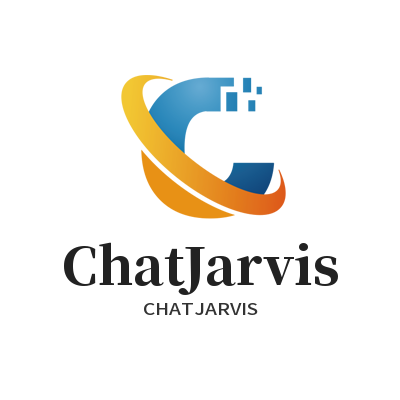

# CHAT贾维斯

This template should help get you started developing with Vue 3 in Vite.


## 🍙 命名规范

1. 视图组件采用短横线命名；要求见名知意 比如 chat-jarvis
2. 视图文件夹采用大驼峰命名  比如ChatJarvis
3. js文件采用首字母小写驼峰命名  比如chatJarvis
4. css文件采用下划线命名  比如chat_jarvis

## 🍻 技术栈

- [node](http://nodejs.org/) 和 [git](https://git-scm.com/) -项目开发环境
- [Vite](https://vitejs.dev/) - 熟悉 vite 特性
- [Vue3](https://v3.vuejs.org/) - 熟悉 Vue@3 基础语法
- [Pinia](https://pinia.vuejs.org/introduction.html#why-should-i-use-pinia) - 熟悉`Pinia`基本语法
- [Es6+](http://es6.ruanyifeng.com/) - 熟悉 es6 基本语法
- [Vue-Router-Next](https://next.router.vuejs.org/) - 熟悉 vue-router 基本使用
- [Mock.js](https://github.com/nuysoft/Mock) - mockjs 基本语法
- [vueuse](https://vueuse.org/) - vue3的hook库

## 🍭 使用项目

### 🌈 安装依赖

```sh
pnpm install
```

### 🐥 启动项目

```sh
pnpm dev

# 或

pnpm serve
```

### 🍁 打包

```sh
pnpm build
```

### 检查代码 [ESLint](https://eslint.org/)

```sh
pnpm lint
```

## 🍣 Git 规范

参考 [vue](https://github.com/vuejs/vue/blob/dev/.github/COMMIT_CONVENTION.md) 规范 ([Angular](https://github.com/conventional-changelog/conventional-changelog/tree/master/packages/conventional-changelog-angular))

- `✨ feat` 增加新功能
- `🐛 fix` 修复问题/BUG
- `🎉 init` 初始化
- `📝 docs` 文档变更
- `💄 style` 代码格式(不影响代码运行的变动)
- `♻️ refactor` 重构(既不是增加feature，也不是修复bug)
- `⚡️ perf` 性能优化
- `✅ test` 增加测试
- `⏪️ revert` 回退
- `🚀‍ build` 构建过程或辅助工具的变动
- `👷 ci` CI 配置

### 🍄 git提交推送代码

#### 前提

```sh
pnpm i -g git-cz commitizen
```

#### 执行

```sh
git add .
```

```sh
pnpm cz
```

```sh
git pull  =>  git push
```

## 🍩 浏览器支持

本地开发推荐使用`Chrome 80+` 浏览器

支持现代浏览器, 不支持 IE
